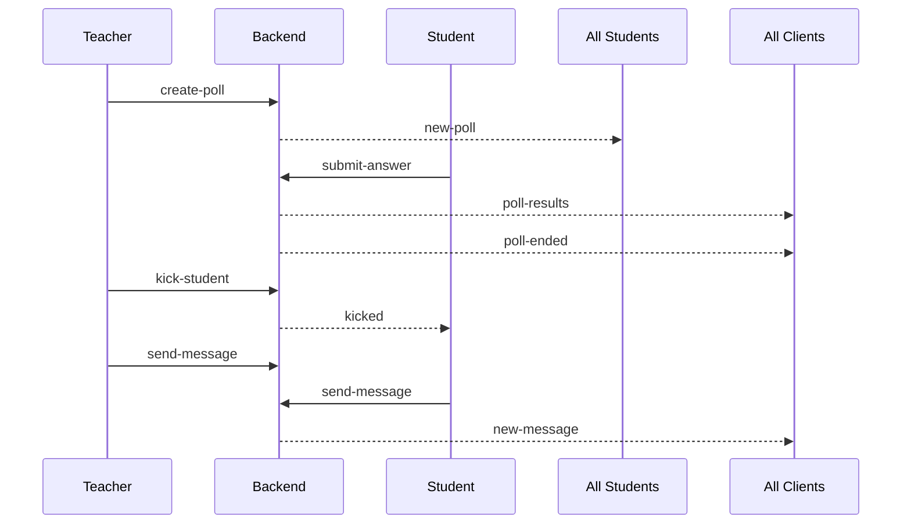

# 🟣 Polling System Backend

This is the **Node.js + Express + Socket.IO backend** powering **Intervue Polling**, a live classroom polling and chat application.

🌐 **Live Backend URL:**
[https://polling-rr4j.onrender.com](https://polling-rr4j.onrender.com)

---

## ✨ Overview

This backend handles:

* Real-time poll creation and broadcasting
* Student participation and answer collection
* Live result calculation and updates
* Kick-out functionality
* Group chat between participants
* History tracking of polls conducted

---

## 🛠️ Features

✅ Create polls with:

* Question text
* Multiple options
* Duration timer
* Correct answers

✅ Real-time events over WebSocket:

* New poll distribution
* Student answer submissions
* Live results updates
* Auto-ending polls when all students respond or time expires

✅ Participant management:

* Join/leave tracking
* Kick out students by name

✅ Group chat:

* Everyone can send and receive messages in real time

✅ CORS support for frontend deployment

---

## ⚙️ Tech Stack

* **Node.js** (runtime)
* **Express** (HTTP server)
* **Socket.IO** (WebSocket communication)
* **CORS** (cross-origin support)
* **(Future)** MongoDB for persistent poll storage

---

## 🧩 How It Works

Here’s a diagram showing the data flow:



---

## 📡 Socket Events

### 🎓 Student Events

✅ **student-join**

```javascript
socket.emit("student-join", studentName);
```

✅ **submit-answer**

```javascript
socket.emit("submit-answer", selectedOption);
```

✅ **send-message**

```javascript
socket.emit("send-message", { sender: name, text });
```

---

### 👩‍🏫 Teacher Events

✅ **create-poll**

```javascript
socket.emit("create-poll", {
  question: "...",
  options: ["A", "B", "C"],
  duration: 60,
  correctAnswers: [true, false, false]
});
```

✅ **kick-student**

```javascript
socket.emit("kick-student", studentName);
```

✅ **send-message**

```javascript
socket.emit("send-message", { sender: "Teacher", text });
```

---

### 📥 Server Emitted Events

✅ **new-poll**

Sent to all students when a new poll starts.

✅ **poll-results**

Sent when new answers are submitted.

✅ **poll-ended**

Sent when poll ends automatically or manually.

✅ **new-message**

Sent when any chat message is posted.

✅ **kicked**

Sent to kicked students.

---

## 🏗️ Project Structure

```
/backend
  ├── index.js               # Main server entry
  ├── models/
  │     └── PollManager.js   # Logic for poll tracking
  └── package.json           # Dependencies & scripts
```

---

## 🏃‍♂️ Running Locally

Clone the repo:

```bash
git clone https://github.com/Rohit-554/Polling.git
cd polling-backend
```

Install dependencies:

```bash
npm install
```

Start the server:

```bash
npm start
```

Your server will run on:

```
http://localhost:5000
```

---

✅ **Note:**
Make sure your frontend is configured to connect:

```javascript
const socket = io("http://localhost:5000");
```

---


## 🚧 Future Improvements

* Persist poll history in MongoDB.
* Authentication for teachers and students.
* Export results as CSV.
* Add room-based polling (multiple sessions).
* Typing indicators in chat.

---

## 🙌 Author

Built with ❤️ by **Jadu**.
